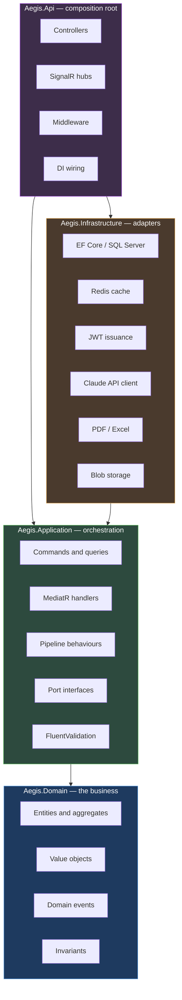
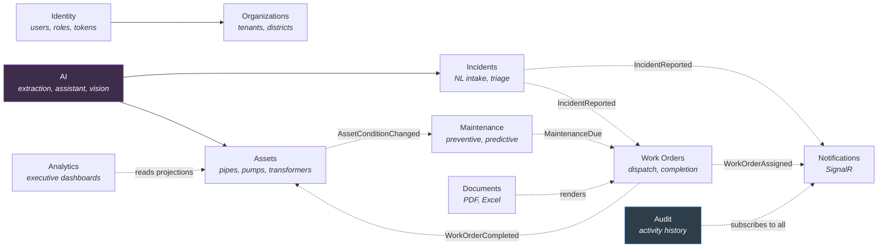

# Aegis — AI-Powered Smart Infrastructure Management Platform

Aegis is an operations platform for the organisations that keep physical infrastructure running:
water utilities, power distributors, municipal road authorities. It tracks assets, ingests incident
reports written in plain language, schedules preventive and predictive maintenance, dispatches work
orders to field technicians, and answers operational questions against live data.

> **Status: in active construction.** This repository is being built one vertical slice at a time.
> The section [Build log](#build-log) records what is complete and verified versus what is planned.
> Nothing is documented here as working unless it builds and its tests pass.

---

## Table of contents

- [Why this exists](#why-this-exists)
- [Architecture](#architecture)
- [Architectural decisions](#architectural-decisions)
- [Technology choices](#technology-choices)
- [Repository layout](#repository-layout)
- [Getting started](#getting-started)
- [Testing strategy](#testing-strategy)
- [Build log](#build-log)

---

## Why this exists

Infrastructure operators run on a stack of disconnected tools: a GIS layer nobody outside the
engineering team can read, a spreadsheet of asset serial numbers, a shared inbox of public
complaints, and a maintenance schedule that is calendar-based rather than condition-based. The
consequences are ordinary and expensive — a pump fails between scheduled inspections, a reported
leak takes three days to reach the crew that could fix it, and nobody can answer "which assets in
the northern district are overdue for inspection?" without a morning of manual work.

Aegis targets four specific gaps:

| Gap | Approach |
| --- | --- |
| Reports arrive as unstructured prose | An LLM extracts asset, location, category and severity from free text, and a human confirms |
| Maintenance is calendar-based | Condition and telemetry-driven scheduling alongside fixed intervals |
| Field crews lose connectivity | Offline-first mobile client with an explicit sync and conflict-resolution protocol |
| Operational questions need an analyst | A data-grounded assistant that queries the domain via tool use rather than guessing |

---

## Architecture

### The dependency rule

Aegis is a **modular monolith** organised as Clean Architecture. Dependencies point strictly
inward; nothing in an inner ring knows an outer ring exists.



`Aegis.Domain` has **no package references at all** — not EF Core, not MediatR. This is enforced by
a test (`tests/Aegis.Domain.UnitTests/Architecture/DependencyTests.cs`), not by convention, because
architecture that lives only in a document decays one reasonable-sounding exception at a time.

### How a request flows

```mermaid
sequenceDiagram
    autonumber
    participant C as Client
    participant Ctrl as Controller
    participant Pipe as MediatR pipeline
    participant H as Handler
    participant D as Domain
    participant DB as SQL Server
    participant Ev as Event dispatcher

    C->>Ctrl: HTTP request + JWT
    Ctrl->>Pipe: Send(command)
    Note over Pipe: Logging → Validation → Authorization<br/>→ Tenant scope → Caching → Transaction
    Pipe->>H: command
    H->>D: invoke domain method
    D-->>H: state change + domain events raised
    H->>DB: SaveChangesAsync
    DB-->>H: committed
    H->>Ev: dispatch events (post-commit only)
    Ev-->>C: SignalR push to subscribed clients
    H-->>Ctrl: Result&lt;T&gt;
    Ctrl-->>C: 200 / 400 / 404 / 409 + ProblemDetails
```

The ordering constraint worth calling out: **domain events dispatch only after the transaction
commits.** If they fired inside the handler, a rollback would leave notifications sent and audit
rows written for a change that never happened.

### Module boundaries

Modules communicate through domain events and public contracts — never by reaching into each
other's entities. That single rule is what makes a later extraction to microservices a mechanical
refactor rather than a rewrite.



Solid arrows are direct dependencies; dotted arrows are asynchronous domain events.

---

## Architectural decisions

Each decision below records the alternative that was rejected and why — a decision without a
discarded alternative is not a decision, it is a default.

### 1. Modular monolith, not microservices on day one

**Chosen:** one deployable API partitioned by module.

Microservices solve organisational scaling problems — independent deployment by independent teams —
at the cost of distributed transactions, network partition handling, and eleven-service local
development. None of those costs buy anything before there are multiple teams. Aegis is structured
so that extraction is possible (modules own their tables, communicate by event, never share
entities), and deferred until it is justified.

### 2. Repository Pattern only where it earns its place

**Chosen:** handlers depend on `IAegisDbContext`; dedicated repositories only for aggregates with
non-trivial reconstitution.

`DbContext` already *is* a Unit of Work and `DbSet<T>` already *is* a repository. Wrapping every
entity in `IGenericRepository<T>` adds a layer that forwards calls verbatim, and it destroys EF
Core's ability to compose a query across includes, filters and projections into one SQL statement —
generic repositories tend to force `.ToList()` at the boundary and filter in memory. Exposing the
context behind an interface keeps Application persistence-agnostic and unit-testable without paying
that price.

### 3. `Result<T>` for expected failures, exceptions for genuine faults

**Chosen:** business outcomes return `Result<T>`; invariant violations throw `DomainException`.

"Asset not found" is not exceptional — it is a routine outcome of a lookup. Modelling it as an
exception hides the failure from the method signature, costs a stack unwind on a common path, and
moves control flow into a `catch` far from the decision. A method returning `Result<Asset>` declares
failure as part of its contract. Exceptions remain for the cases where the correct response is a
bug report, and are caught once by global middleware that emits RFC 7807 `ProblemDetails`.

### 4. Tenant isolation is infrastructural, not disciplinary

**Chosen:** shared database, `ITenantOwned` marker, EF Core global query filters.

The alternative — every handler remembers `.Where(x => x.OrganizationId == current)` — fails the
moment one developer forgets once, and the failure mode is cross-tenant data disclosure. Global
query filters mean a developer writing `_db.Assets.Where(a => a.Status == Active)` gets
tenant-scoped results without knowing tenancy exists. Database-per-tenant offers stronger isolation
but adds a catalog database, dynamic connection resolution and fan-out migrations; that cost is
real and is not justified at this scale.

The honest trade-off: global filters can be bypassed with `IgnoreQueryFilters()`, so its use is
restricted to a small audited set of system operations.

### 5. UUIDv7 primary keys

**Chosen:** `Guid.CreateVersion7()` rather than `Guid.NewGuid()` or `int` identity.

Random v4 GUIDs as a clustered index key cause page splits and index fragmentation on every insert,
which on a table of millions of telemetry-adjacent rows is a measurable write penalty. UUIDv7 is
time-ordered, so inserts append to the end of the B-tree like an identity column, while keeping the
properties that matter here: ids generatable client-side (essential for the offline mobile client,
which must create work order records with no server round trip) and non-enumerable in URLs.

### 6. Domain events dispatched after commit

**Chosen:** entities collect events; a `SaveChanges` interceptor publishes them once the
transaction succeeds.

Dispatching inside the handler risks a notification sent, an audit row written and a cache
invalidated for a transaction that subsequently rolls back. Post-commit dispatch makes the
side effects consistent with the data.

### 7. Central Package Management

**Chosen:** all versions in `Directory.Packages.props`.

Version drift between projects in a seven-project solution produces `MethodNotFoundException` at
runtime rather than a compile error. One file, one version, one place to audit.

Two package choices are deliberate and worth recording: **Shouldly** rather than FluentAssertions
(version 8 requires a paid commercial licence), and **NSubstitute** rather than Moq (the SponsorLink
telemetry episode). **MediatR is pinned to 12.x** for the same reason — 13.0 moved to a commercial
licence.

---

## Technology choices

### Backend

| Concern | Choice | Rationale |
| --- | --- | --- |
| Runtime | .NET 9 / ASP.NET Core 9 | Long-term support path, mature tooling, strong async story |
| Data access | EF Core 9 + SQL Server | Global query filters and interceptors are what make tenancy and auditing automatic |
| Spatial | NetTopologySuite | `geography` column type gives real distance and containment queries in SQL, not post-filtering in C# |
| Messaging | MediatR 12 | In-process dispatch with a pipeline that gives cross-cutting concerns one home |
| Validation | FluentValidation | Rules live beside the command, testable without a HTTP request |
| Cache | Redis | Shared across instances, and the backplane SignalR needs when scaled out |
| Real-time | SignalR | WebSocket transport with automatic fallback and a Redis backplane |
| Logging | Serilog | Structured logs; correlation ids queryable rather than grep-able |
| Mapping | Mapster | Source-generated, no runtime reflection cost |
| Documents | QuestPDF + ClosedXML | Both permissively licensed with no native dependencies |

### Frontend

| Concern | Choice | Rationale |
| --- | --- | --- |
| Framework | Next.js (App Router) + TypeScript | Server components for dashboards, client components where interaction demands it |
| Styling | Tailwind CSS | Design tokens as constraints, and dark mode without a parallel stylesheet |
| Server state | TanStack Query | Caching, background refetch and optimistic updates — the hard parts of a live dashboard |
| Client state | Zustand | Small, unopinionated, no provider pyramid |
| Motion | Framer Motion | Meaningful transitions; honours `prefers-reduced-motion` |
| Maps | Leaflet + OpenStreetMap | No API key, no per-tile billing, no vendor lock-in |

The state-management split is deliberate: **TanStack Query owns anything that came from the server,
Zustand owns anything that did not.** Mixing them — copying fetched data into a client store — is
the most common source of stale UI in dashboards of this kind.

---

## Repository layout

```
Aegis/
├── src/
│   ├── Aegis.Domain/           # Entities, value objects, domain events. Zero dependencies.
│   ├── Aegis.Application/      # CQRS handlers, validators, port interfaces.
│   ├── Aegis.Infrastructure/   # EF Core, Redis, JWT, Claude client, PDF/Excel.
│   └── Aegis.Api/              # Controllers, hubs, middleware, composition root.
├── tests/
│   ├── Aegis.Domain.UnitTests/        # Domain logic + architecture enforcement.
│   ├── Aegis.Application.UnitTests/   # Handler behaviour against substituted ports.
│   └── Aegis.Api.IntegrationTests/    # Full stack against Testcontainers SQL Server + Redis.
├── docs/                       # Architecture decision records, ER diagram, API reference.
├── Directory.Build.props       # Compiler settings for every project.
├── Directory.Packages.props    # Central package versions.
└── global.json                 # Pins the .NET SDK to 9.0.
```

---

## Getting started

### Prerequisites

- .NET SDK 9.0
- Docker Desktop (SQL Server, Redis, and the integration test suite)
- Node.js 20+ (frontend, once added)

### Build and test

```bash
dotnet restore
dotnet build
dotnet test
```

### Run the API

```bash
dotnet run --project src/Aegis.Api
```

Liveness probe: `GET /health/live`.

---

## Testing strategy

Three tiers, each answering a different question:

| Tier | Question it answers | Dependencies |
| --- | --- | --- |
| Domain unit tests | Are the business rules correct? | None — pure objects |
| Application unit tests | Does the handler orchestrate correctly? | Substituted ports |
| API integration tests | Does the whole stack behave? | Real SQL Server + Redis via Testcontainers |

Integration tests deliberately avoid the EF Core in-memory provider. It does not enforce unique
constraints, does not translate the same SQL, and does not exercise global query filters the way the
real provider does — so a green in-memory suite would prove very little about tenant isolation,
which is precisely the property most needing proof.

A fourth category, **architecture tests**, asserts the dependency rule itself and fails the build if
an inner layer acquires an outward reference.

---

## Build log

### Complete and verified

**Increment 0 — Foundation** *(build green, 26 tests passing)*

- Seven-project solution with the dependency rule wired and enforced
- Central Package Management; warnings treated as errors solution-wide
- `.editorconfig` encoding naming, async correctness and security analyzer policy
- Domain kernel: `Entity<TId>`, `AggregateRoot<TId>`, `ValueObject`, `IDomainEvent`,
  `Result`/`Result<T>`, `Error`, `DomainException`
- Entity contracts: `ITenantOwned`, `IAuditableEntity`, `ISoftDeletable`
- Architecture test proving `Aegis.Domain` references nothing outside the BCL
- Liveness endpoint

### Planned

| # | Increment | Delivers |
| --- | --- | --- |
| 1 | Persistence + cross-cutting | `AegisDbContext`, interceptors for audit/tenant/soft-delete, MediatR pipeline behaviours, Serilog, global exception handling |
| 2 | Identity | Registration, login, refresh tokens, RBAC, permission-based authorization |
| 3 | Organizations | Tenants, districts, membership, invitations |
| 4 | Assets | Asset hierarchy, spatial data, condition tracking, pagination and filtering |
| 5 | Incidents | Natural-language intake with Claude extraction, triage, deduplication |
| 6 | Work orders | Dispatch, assignment, completion, offline sync protocol |
| 7 | Maintenance | Preventive schedules and predictive scoring |
| 8 | Real-time | SignalR hubs with Redis backplane |
| 9 | Analytics | Executive dashboards and read projections |
| 10 | Documents | PDF and Excel generation |
| 11 | AI assistant | Tool-use grounded in tenant-scoped data |
| 12 | Vision | Image upload with AI-assisted defect analysis |
| 13 | Frontend | Next.js application and reusable component library |
| 14 | DevOps | Docker Compose and GitHub Actions CI/CD |

---

## Licence

Not yet determined.
